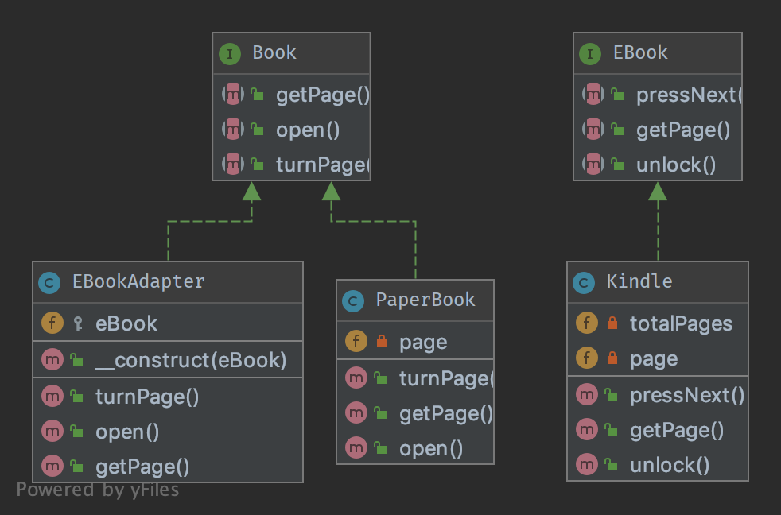

# Atividade — Padrão de Projeto Adapter (Structural / Adapter)

Documentação dos passos executados para a construção do método `EBookAdapter`, aplicando o
padrão de projeto estrutural **Adapter** sobre o projeto base [DesignPatternsPHP](https://github.com/DesignPatternsPHP/DesignPatternsPHP).

##  Integrantes:
- Miguel Gustavo de Sousa Campos
- Henrique de Moraes Rodrigues

## 1. Clonagem do repositório

```bash
git clone https://github.com/DesignPatternsPHP/DesignPatternsPHP.git
cd DesignPatternsPHP
```

## 2. Instalação das dependências

```bash
composer install
```

Dependências instaladas: PHPUnit (testes), Psalm (análise estática) e PHP_CodeSniffer, conforme
declarado no `composer.json` do repositório.

## 3. Mapeamento do domínio (`Structural/Adapter`)

| Componente | Papel no padrão | Descrição |
|---|---|---|
| `Book` (interface) | **Target** | Contrato esperado pelo cliente: `open()`, `turnPage()`, `getPage(): int` |
| `PaperBook` | Implementação concreta do Target | Implementa `Book` diretamente, sem necessidade de adaptação |
| `EBook` (interface) | **Adaptee Interface** | Contrato do subsistema externo, com nomenclatura própria: `unlock()`, `pressNext()`, `getPage(): array` |
| `Kindle` | **Adaptee** | Implementa `EBook`; simula um leitor digital de terceiros cujas assinaturas divergem de `Book` |

## 4. Identificação do conflito

O código cliente que consome objetos do tipo `Book` não consegue usar um `Kindle` diretamente,
pois:

- os nomes dos métodos são diferentes (`open` × `unlock`, `turnPage` × `pressNext`);
- o tipo de retorno de `getPage()` também diverge (`int` em `Book` × `array` (`int[]`) em `EBook`,
  no formato `[paginaAtual, totalDePaginas]`).

Sem um adaptador, o cliente precisaria conhecer e tratar as duas interfaces, quebrando o
princípio Open/Closed e acoplando o cliente a detalhes do subsistema externo.

## 5. Criação da classe adaptadora — `EBookAdapter.php`

Arquivo criado em `Structural/Adapter/EBookAdapter.php`.

### Implementação do contrato e composição

- A classe **implementa `Book`**, garantindo compatibilidade total com o código cliente já
  existente (ele continua trabalhando apenas com a interface `Book`, sem saber que por trás
  existe um `Kindle`).
- A classe **recebe uma instância de `EBook` via injeção de dependência no construtor**
  (`__construct(protected EBook $eBook)`), usando **composição** em vez de herança — o adaptador
  *tem um* `EBook`, ele não *é um* `EBook`.
- Cada método de `Book` traduz a chamada para o método equivalente em `EBook`:

```php
class EBookAdapter implements Book
{
    public function __construct(protected EBook $eBook)
    {
    }

    public function open()
    {
        $this->eBook->unlock();       // open()      -> unlock()
    }

    public function turnPage()
    {
        $this->eBook->pressNext();    // turnPage()  -> pressNext()
    }

    public function getPage(): int
    {
        return $this->eBook->getPage()[0]; // adapta array[int,int] -> int
    }
}
```

O método `getPage()` também resolve a divergência de **tipo de retorno**: `EBook::getPage()`
devolve um array `[paginaAtual, totalDePaginas]`, mas o contrato de `Book::getPage()` exige
apenas um `int` — o adaptador extrai o primeiro elemento do array.

## 6. Validação com testes automatizados

Os testes de `Structural/Adapter/Tests/AdapterTest.php` foram executados para validar o
comportamento do adaptador:

```bash
vendor/bin/phpunit Structural/Adapter/Tests/
```

Resultado:

```
PHPUnit 9.6.13 by Sebastian Bergmann and contributors.

..                                                                  2 / 2 (100%)

Time: 00:00.002, Memory: 6.00 MB

OK (2 tests, 2 assertions)
```

- `testCanTurnPageOnBook`: valida o comportamento padrão com `PaperBook`.
- `testCanTurnPageOnKindleLikeInANormalBook`: instancia um `Kindle`, envolve-o em um
  `EBookAdapter` e comprova que o cliente consegue chamar `open()`, `turnPage()` e `getPage()`
  normalmente, como se estivesse lidando com um `Book` comum — mesmo o objeto real sendo um
  `Kindle`.

## 7. Diagrama UML (fornecido pelo projeto base)



## Conclusão

O padrão **Adapter** permitiu integrar o subsistema externo `Kindle` (com interface incompatível)
ao contrato `Book` esperado pelo cliente, **sem alterar nem o código cliente, nem a classe
`Kindle`**. A solução usa composição (o adaptador guarda uma referência ao objeto adaptado) em
vez de herança múltipla ou modificação direta das classes existentes, respeitando o princípio
Open/Closed do SOLID.
