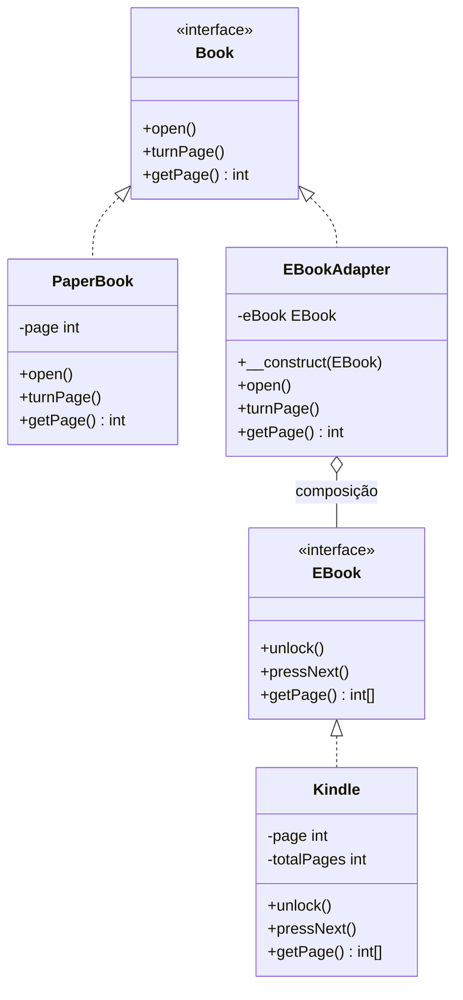

# 🔌 Atividade — Padrão de Projeto *Adapter* (Structural / Adapter)

[](https://www.php.net/)
[](https://phpunit.de/)
[](https://refactoring.guru/design-patterns/adapter)
[]()

Documentação estruturada dos passos executados para a construção da classe
`EBookAdapter`, aplicando o **padrão de projeto estrutural Adapter (GoF)**
sobre o projeto base [DesignPatternsPHP](https://github.com/DesignPatternsPHP/DesignPatternsPHP).

## 👥 Integrantes
 
| Nome |
|---|
| Miguel Gustavo de Sousa Campos |
| Henrique de Moraes Rodrigues |
---

## 📑 Sumário

1. [Visão geral do padrão](#-visão-geral-do-padrão)
2. [Clonagem do repositório](#1️⃣-clonagem-do-repositório)
3. [Instalação das dependências](#2️⃣-instalação-das-dependências)
4. [Mapeamento do domínio](#3️⃣-mapeamento-do-domínio-structuraladapter)
5. [Diagrama de classes](#-diagrama-de-classes)
6. [Identificação do conflito](#4️⃣-identificação-do-conflito)
7. [Implementação do EBookAdapter](#5️⃣-implementação-da-classe-adaptadora--ebookadapterphp)
8. [Princípios de design aplicados](#-princípios-de-design-aplicados)
9. [Validação com testes automatizados](#6️⃣-validação-com-testes-automatizados)
10. [Ambiente de execução (Windows)](#-ambiente-de-execução-windows)
11. [Vantagens e trade-offs do Adapter](#️-vantagens-e-trade-offs-do-padrão-adapter)
12. [Conclusão](#-conclusão)

---

## 🧩 Visão geral do padrão

> **Adapter** (também chamado de *Wrapper*) é um padrão de projeto
> **estrutural** do catálogo GoF (*Gang of Four*) que permite que objetos
> com interfaces incompatíveis colaborem entre si, convertendo a interface
> de uma classe em outra que o cliente espera — sem alterar o código de
> nenhuma das duas partes.

Neste projeto, o padrão resolve a incompatibilidade entre:

- um cliente que consome livros através do contrato `Book` (`open()`,
  `turnPage()`, `getPage(): int`);
- e um leitor digital de terceiros, `Kindle`, que implementa `EBook` com uma
  nomenclatura própria (`unlock()`, `pressNext()`, `getPage(): array`).

---

## 1️⃣ Clonagem do repositório

```bash
git clone https://github.com/DesignPatternsPHP/DesignPatternsPHP.git
cd DesignPatternsPHP
```

## 2️⃣ Instalação das dependências

```bash
composer install
```

| Dependência | Papel |
|---|---|
| `phpunit/phpunit` | Execução da suíte de testes automatizados |
| `vimeo/psalm` | Análise estática de tipos |
| `squizlabs/php_codesniffer` | Padronização de estilo de código |

## 3️⃣ Mapeamento do domínio (`Structural/Adapter`)

| Componente | Papel no padrão | Descrição |
|---|---|---|
| `Book` *(interface)* | 🎯 **Target** | Contrato esperado pelo cliente: `open()`, `turnPage()`, `getPage(): int` |
| `PaperBook` | Implementação nativa do Target | Implementa `Book` diretamente — nenhuma adaptação necessária |
| `EBook` *(interface)* | 🔧 **Adaptee Interface** | Contrato do subsistema externo: `unlock()`, `pressNext()`, `getPage(): int[]` |
| `Kindle` | 🔧 **Adaptee** | Simula um leitor digital de terceiros com assinaturas divergentes de `Book` |
| `EBookAdapter` | 🔌 **Adapter** | Implementa `Book` e traduz internamente as chamadas para `EBook` |

### Comparativo de assinaturas

| Ação | `Book` (Target) | `EBook` (Adaptee) |
|---|---|---|
| Abrir/destravar | `open(): void` | `unlock(): void` |
| Avançar página | `turnPage(): void` | `pressNext(): void` |
| Página atual | `getPage(): int` | `getPage(): int[]` → `[páginaAtual, totalPáginas]` |

## 🗺 Diagrama de classes



*(Também disponível como imagem estática em [`Structural/Adapter/uml/uml.png`](DesignPatternsPHP/Structural/Adapter/uml/uml.png), fornecida pelo projeto base.)*

## 4️⃣ Identificação do conflito

O código cliente que consome objetos `Book` **não consegue** usar um
`Kindle` diretamente, por dois motivos:

1. **Nomes de métodos divergentes** — `open()` × `unlock()`,
   `turnPage()` × `pressNext()`.
2. **Tipo de retorno divergente** — `Book::getPage()` devolve `int`,
   enquanto `EBook::getPage()` devolve um array `int[]` no formato
   `[páginaAtual, totalDePáginas]`.

Sem um adaptador, o cliente precisaria conhecer as duas interfaces e
tratar cada uma de forma diferente, violando o **princípio Open/Closed**
(o cliente teria que ser modificado toda vez que um novo tipo de leitor
fosse integrado).

## 5️⃣ Implementação da classe adaptadora — `EBookAdapter.php`

Arquivo criado em `Structural/Adapter/EBookAdapter.php`:

```php
<?php

declare(strict_types=1);

namespace DesignPatterns\Structural\Adapter;

/**
 * EBookAdapter (o "Adapter" / Adaptador)
 *
 * Implementa Book para que o cliente continue funcionando sem alterações,
 * e usa COMPOSIÇÃO (injeção via construtor) para guardar uma referência
 * ao EBook adaptado, ao invés de herdar dele.
 */
class EBookAdapter implements Book
{
    public function __construct(protected EBook $eBook)
    {
    }

    /** Tradução: Book::open() -> EBook::unlock() */
    public function open()
    {
        $this->eBook->unlock();
    }

    /** Tradução: Book::turnPage() -> EBook::pressNext() */
    public function turnPage()
    {
        $this->eBook->pressNext();
    }

    /**
     * Tradução de tipo de retorno: EBook::getPage() devolve
     * [páginaAtual, totalDePáginas] (int[]); Book::getPage() exige
     * apenas um int — extraímos o primeiro elemento do array.
     */
    public function getPage(): int
    {
        return $this->eBook->getPage()[0];
    }
}
```

## 📐 Princípios de design aplicados

- **Composição sobre herança** — o adaptador *tem um* `EBook` (via
  `protected EBook $eBook`) em vez de herdar dele, evitando acoplamento
  rígido e permitindo trocar o objeto adaptado em tempo de execução.
- **Injeção de dependência** — a instância de `EBook` é recebida pelo
  construtor, e não instanciada internamente, facilitando testes e
  substituições (poderia ser qualquer outra implementação de `EBook`).
- **Open/Closed Principle (SOLID)** — o cliente e a classe `Kindle`
  permanecem intocados; toda a lógica de tradução fica isolada em uma
  única classe nova.
- **Single Responsibility Principle (SOLID)** — o `EBookAdapter` tem uma
  única responsabilidade: traduzir chamadas entre as duas interfaces.

## 6️⃣ Validação com testes automatizados

```bash
vendor/bin/phpunit Structural/Adapter/Tests/
```

**Resultado:**

```
PHPUnit 9.6.13 by Sebastian Bergmann and contributors.

..                                                                  2 / 2 (100%)

Time: 00:00.009, Memory: 6.00 MB

OK (2 tests, 2 assertions)
```

| Teste | O que valida |
|---|---|
| `testCanTurnPageOnBook` | Comportamento padrão de um `Book` nativo (`PaperBook`) |
| `testCanTurnPageOnKindleLikeInANormalBook` | Um `Kindle` envolvido em `EBookAdapter` se comporta como um `Book` comum — o cliente chama `open()`, `turnPage()` e `getPage()` normalmente, sem saber que por trás existe um `Kindle` |

## 🖥 Ambiente de execução (Windows)

Resumo do ambiente usado para rodar e validar a atividade localmente:

| Ferramenta | Versão | Observação |
|---|---|---|
| PHP | 8.3.11 (NTS) | Extensões habilitadas manualmente no `php.ini`: `zip`, `mbstring`, `fileinfo`, `curl`, `openssl` |
| Composer | 2.10.3 | Instalado via `Composer-Setup.exe` |
| PHPUnit | 9.6.13 | Instalado como dependência de desenvolvimento via `composer install` |
| Editor | Visual Studio Code | Terminal integrado (PowerShell/CMD) |

> 💡 Ponto de atenção: por padrão o `php.ini` não existe (só os templates
> `php.ini-development` / `php.ini-production`); é necessário copiar um
> deles e renomear para `php.ini`, além de descomentar as extensões
> necessárias para o Composer (`zip` é obrigatória para baixar pacotes).

## ⚖️ Vantagens e trade-offs do padrão Adapter

| ✅ Vantagens | ⚠️ Trade-offs |
|---|---|
| Reaproveita código existente (`Kindle`) sem modificá-lo | Adiciona uma camada extra de indireção |
| Cliente permanece desacoplado do subsistema externo | Se houver muitos Adaptees diferentes, o número de classes cresce |
| Facilita testes (pode-se mockar `EBook`) | Alguma perda de informação pode ocorrer na tradução (ex.: `getPage()` descarta o total de páginas) |
| Segue o Open/Closed Principle | Não resolve incompatibilidades profundas de comportamento, só de interface |

## ✅ Conclusão

O padrão **Adapter** permitiu integrar o subsistema externo `Kindle`
(com interface incompatível) ao contrato `Book` esperado pelo cliente,
**sem alterar nem o código cliente, nem a classe `Kindle`**. A solução
usa **composição** — o adaptador guarda uma referência ao objeto
adaptado — em vez de herança múltipla ou modificação direta das classes
existentes, respeitando os princípios **SOLID** e mantendo o sistema
aberto para extensão e fechado para modificação.

---

<div align="center">

**Miguel Gustavo de Sousa Campos** · **Henrique de Moraes Rodrigues**
FATEC Zona Leste (CPS)

</div>
